# MooInfo

A visual implementation of OSHI, to view information about the system and hardware.

Such as OS, processes, memory, CPU, disks, devices, sensors, etc.
## Screenshot
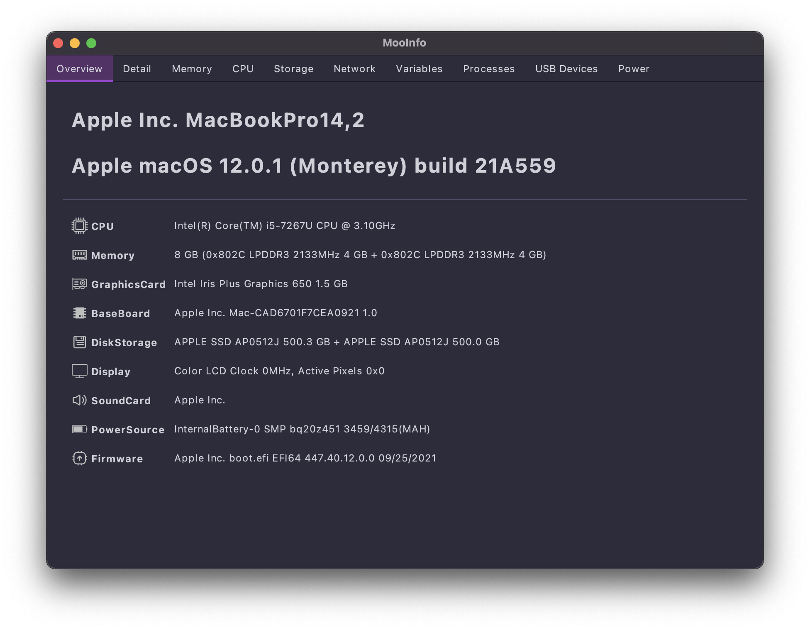
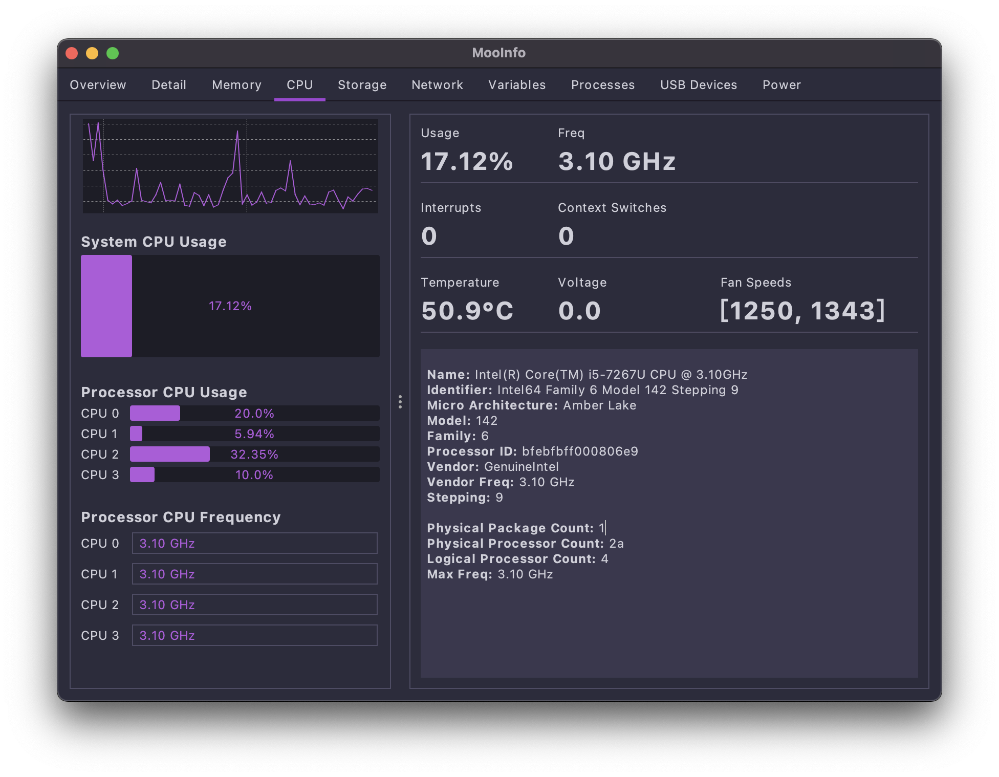
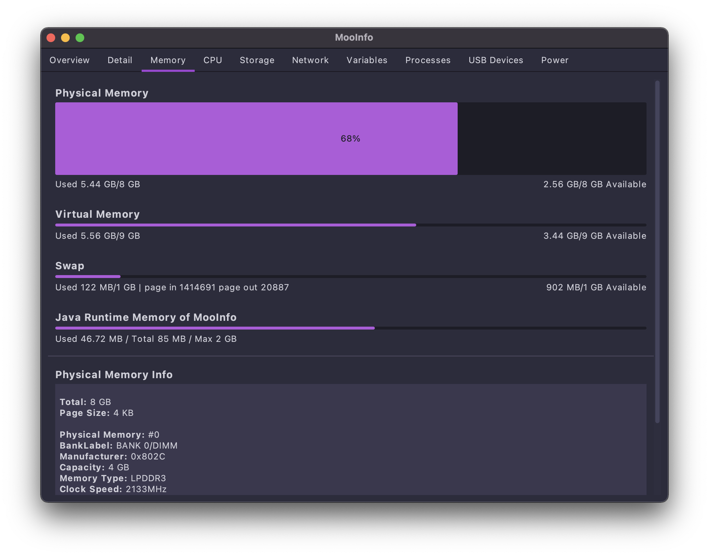
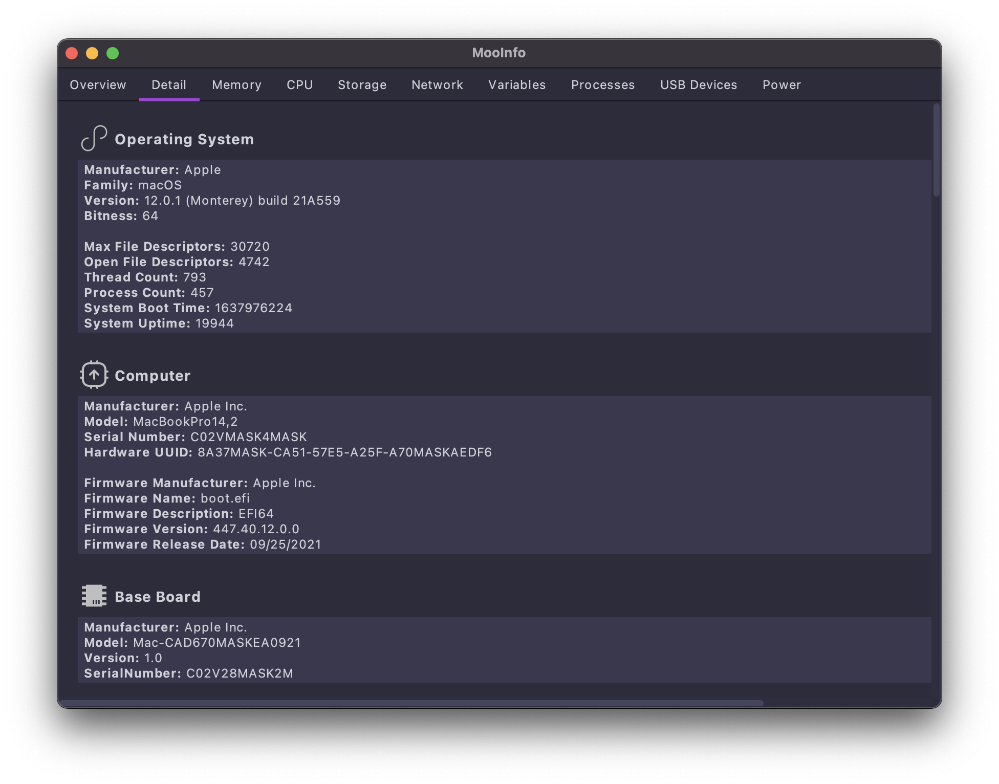
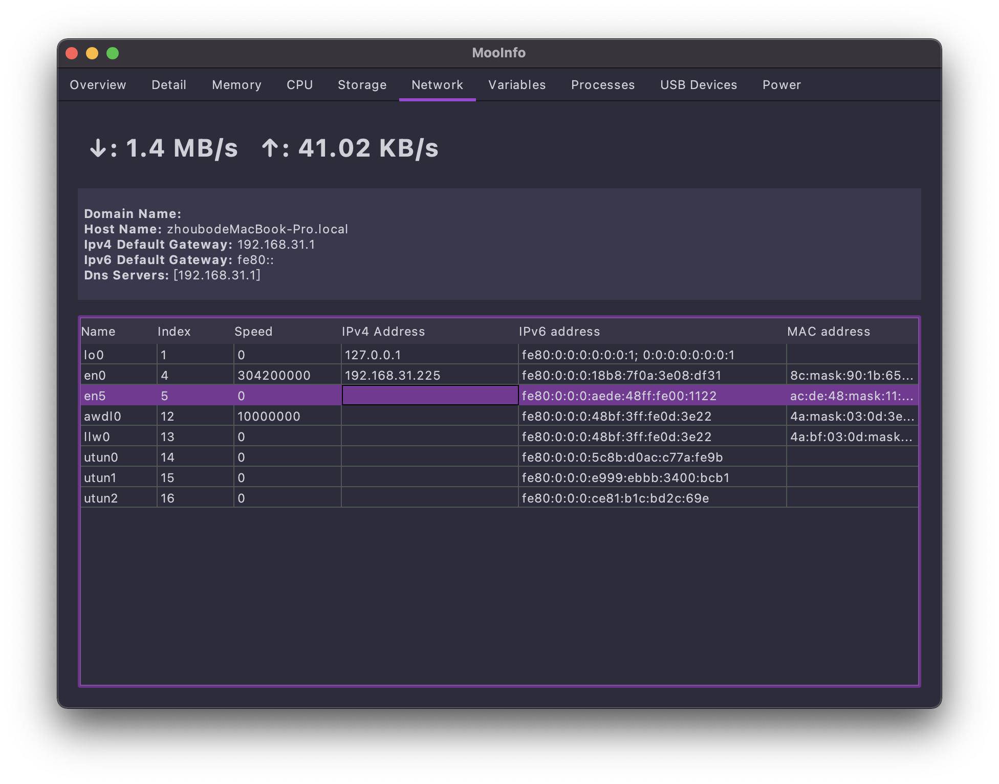
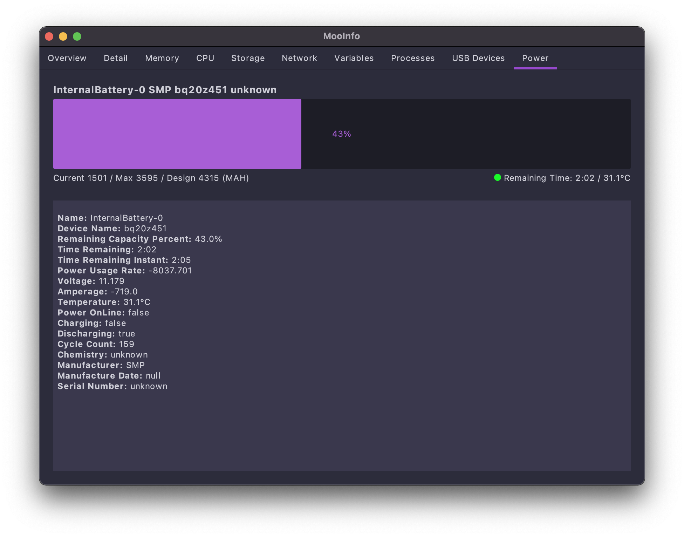
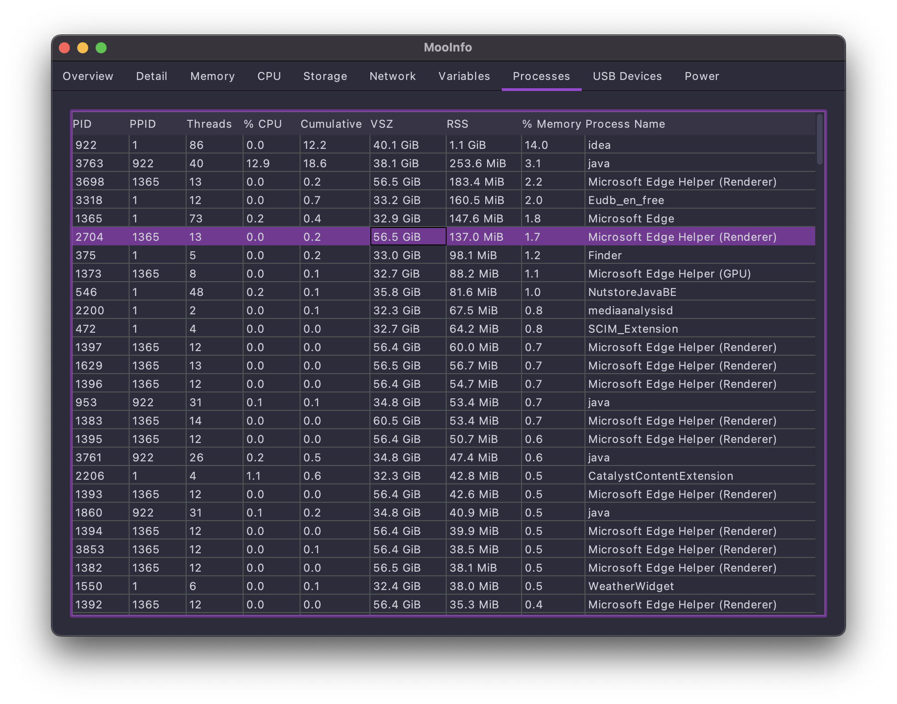
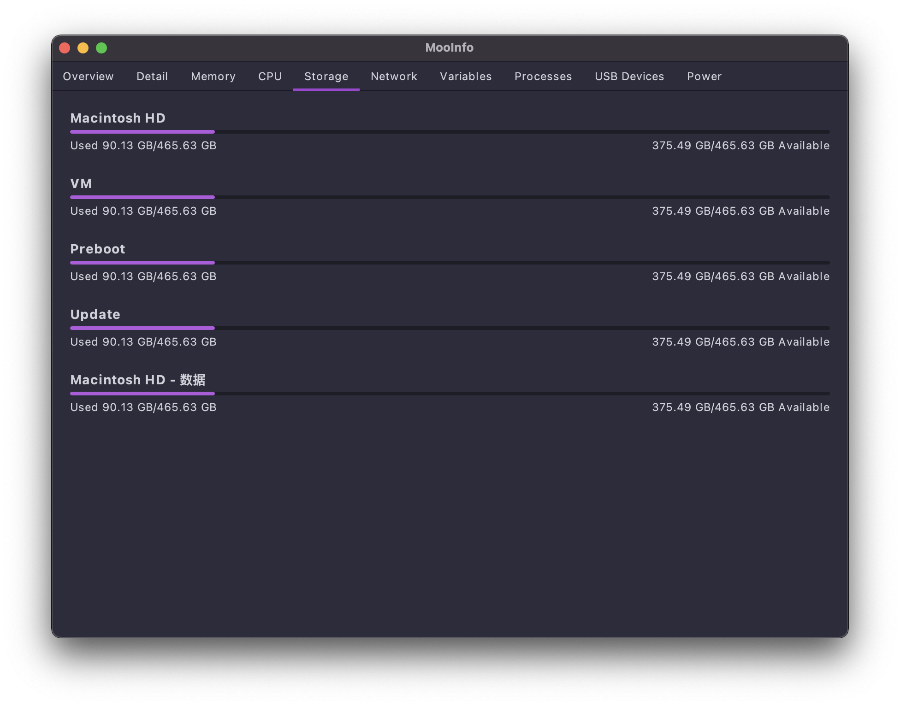
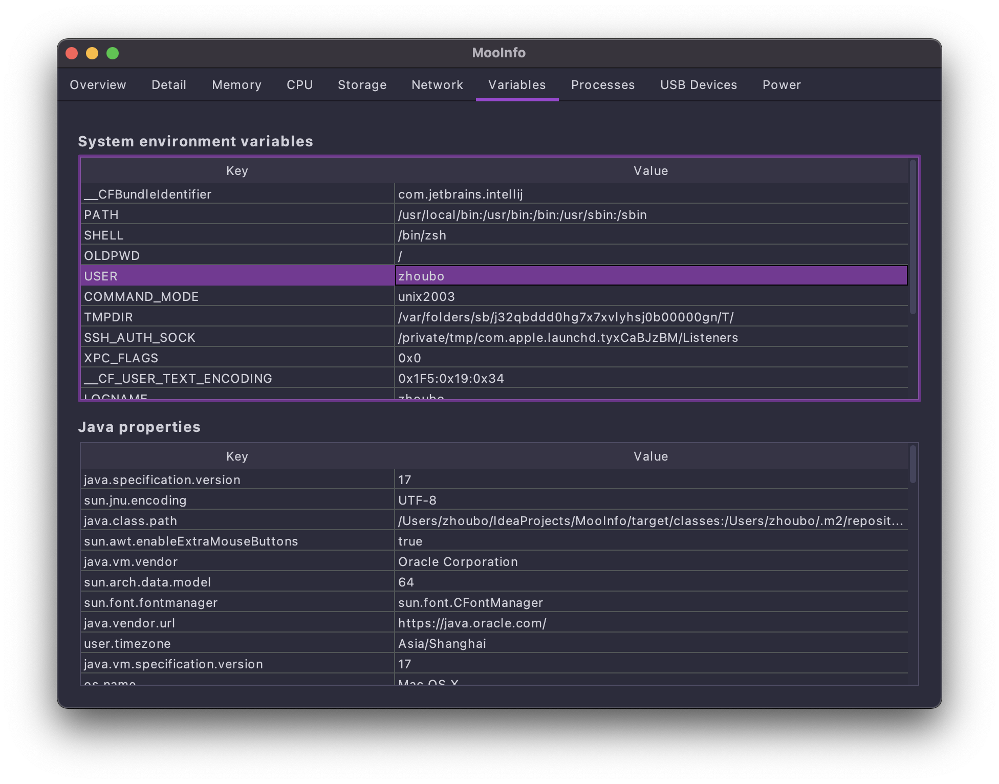
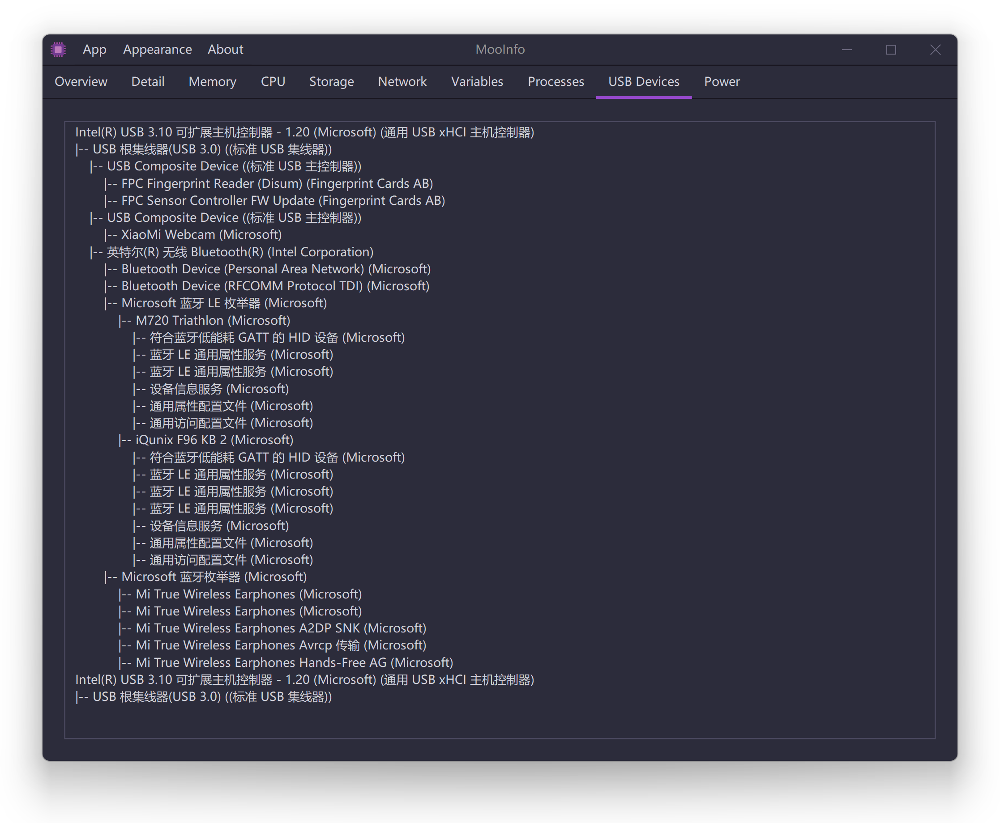

More themes:

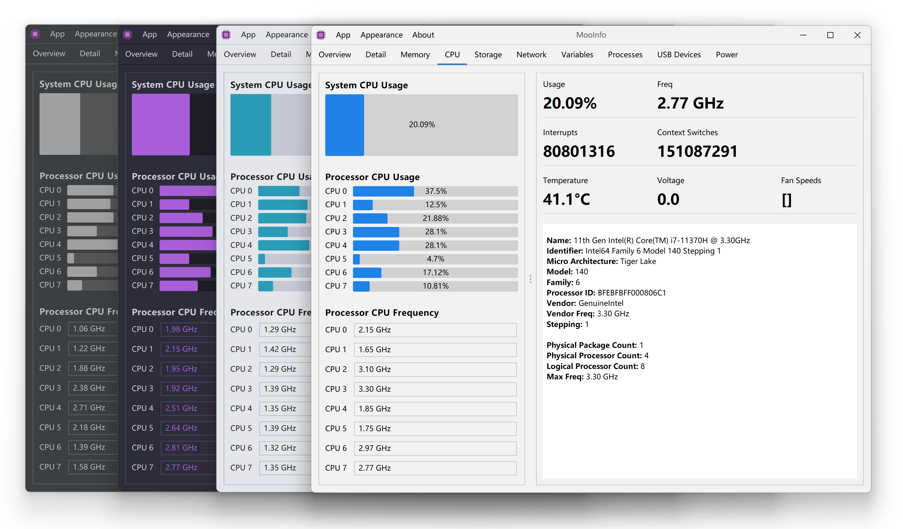

[More Screenshot on Windows](screenshot/)
## Download
[https://github.com/rememberber/MooInfo/releases](https://github.com/rememberber/MooInfo/releases)  
[https://gitee.com/zhoubochina/MooInfo/releases](https://gitee.com/zhoubochina/MooInfo/releases)  
## Thanks to
[FlatLaf](https://github.com/JFormDesigner/FlatLaf)  
[oshi](https://github.com/oshi/oshi)  
[Hutool](http://hutool.cn/)  
[iconfont](https://www.iconfont.cn/)  